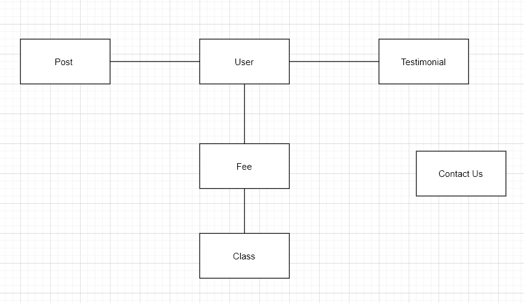
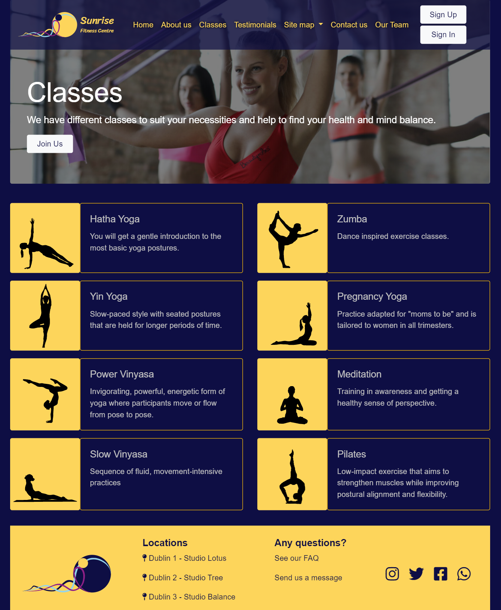
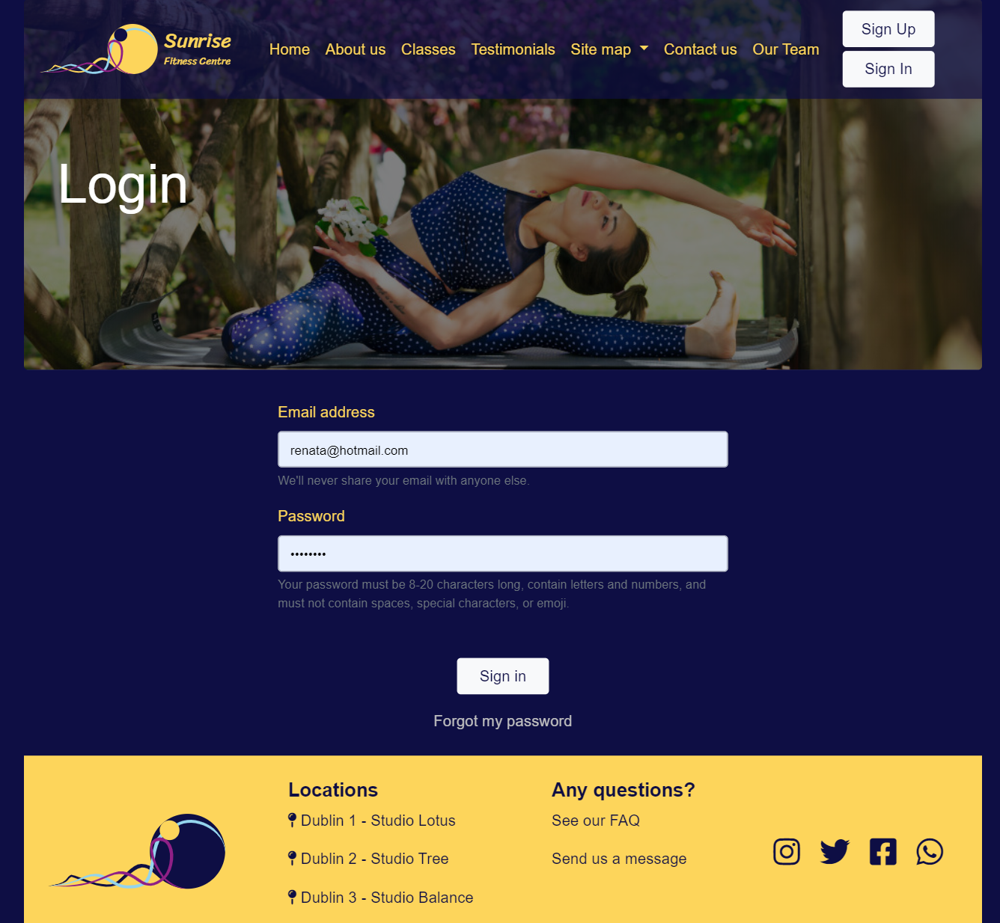
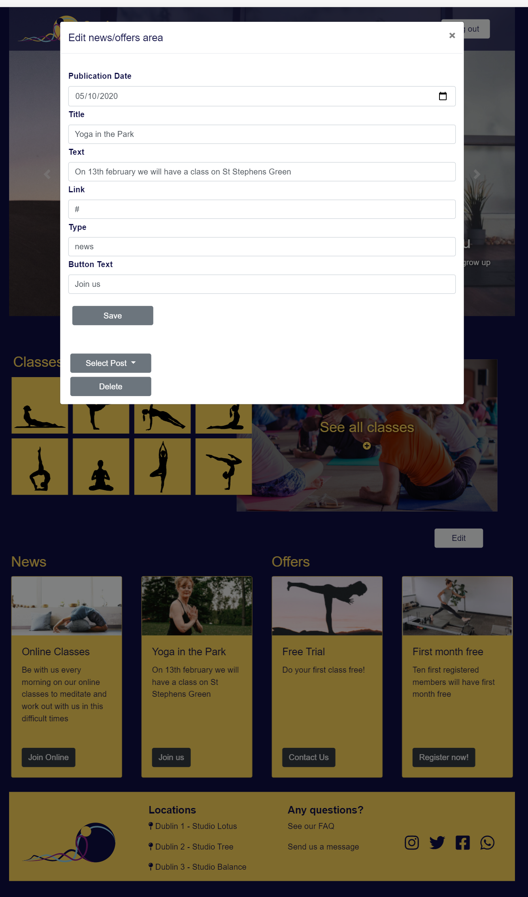
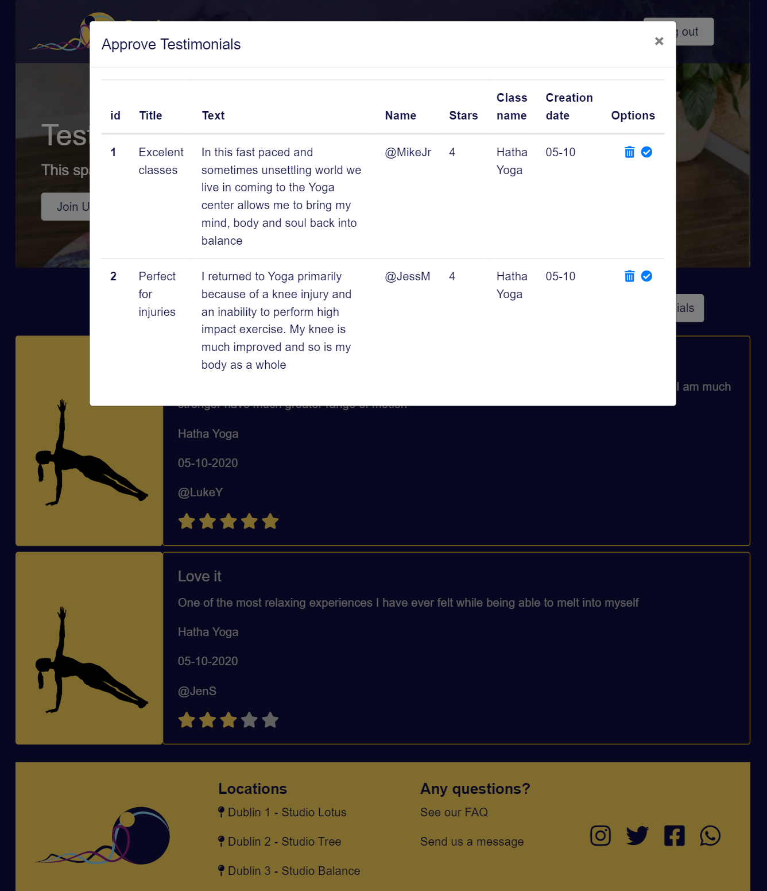
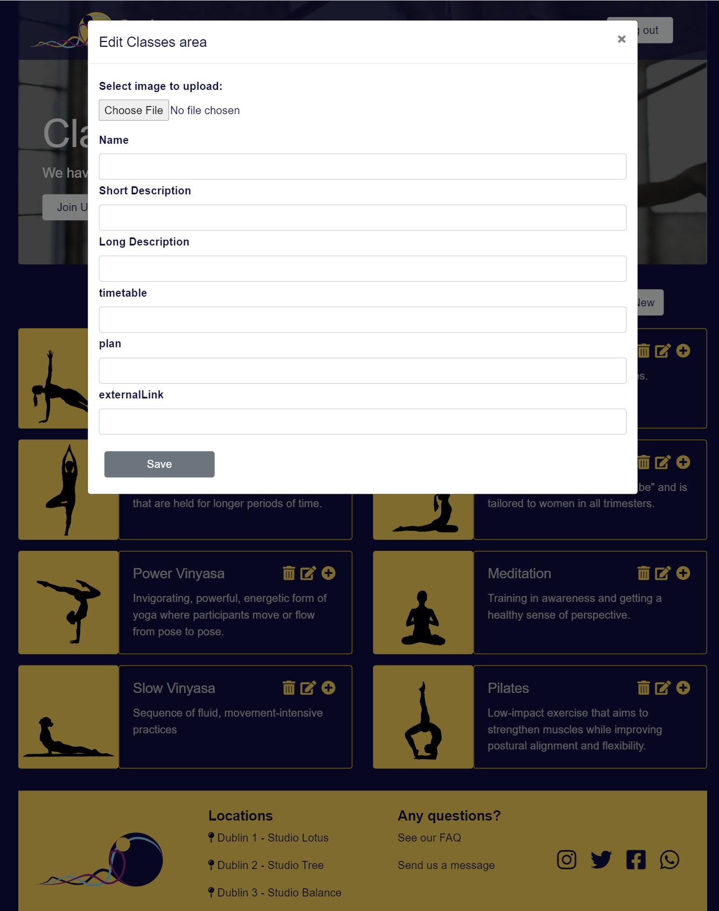

# Sunrise Fitness Center
Software Engineering for Web Applications final project. 

## Developed By

**Cristina Oliveira: https://github.com/cristinaoliveira86** 

**Renata Covisi Pereira: https://github.com/renatacovisi**

## Requirements

The assignment had the following requirements: 

### User levels
The website has 3 user levels:
- Public
- Member
- Admin

### Pages and functionalities
A description of each page, controller script and view followed by the user level access can be found in the table below: 

Name | Function | Main Table | Public | Member | Admin
:---: | :---: | :---: | :---: | :---: | :---: 
index | Basic information about Fitness Centre plus 2 feature boxes. | page | Y | Y | Y 
index_edit | Allows the editing of the feature information presented on the homepage. | page  | N | N | Y
registration | Displays fee information and allows a member to register. | user & fee | Y | Y | Y
registration_edit | Allows the fee information to be updated | fee | N | N | Y
class | Displays a list of class summaries, and their associated photo, and link. The link brings the logged-in user to the relevant class page. | class | Y | Y | Y
class_details | Show 1 attractively formatted row from the class table. This is shown when a link is clicked on the class page. | class | N | Y | Y 
class_details_edit  | Allows the editing of the class information | class | N | N | Y
testimonial | Shows a list of admin approved testimonials given by members | testimonial | Y | Y | Y
testimonial_add | Allows a logged-in member to give a testimonial about a class.  | testimonial | N | Y | Y 
testimonial_manage | Allows the admin to decide which testimonials are displayed. | testimonial | N | N | Y
contact_us | Form enabling members of the public to leave a message.| contact_us | Y | Y | Y
contact_us_manage | Allows the reading of the messages. | contact_us | N | Y | Y
header | Session start, connect.php, links to all pages appropriate to the user level. Prevent unauthenticated users from accessing restricted content. Contains a navigation bar that queries the page table to populate a dropdown with the name of all accessible pages.  | n/a | Y | Y | Y
logout | When this logout script executes the session is destroyed and the user receives a logout confirmation message and then is returned to the index page. | n/a| Y | Y | Y

## Architecture and Design

### Database schema and entity representation in PHP

A description of each SQL table can be found in the table below: 

Name | Function
:---: | :---:
page | holds information about each page, such as minimum user level required and page names
user | holds information about users, such as user-level, e-mail and password
fee | holds information about fee plans, such as name and price
class | holds information about classes, such as name, time and teacher
testimonial | holds information about a user testimonial, such as text, status and member name
contact_us | holds information about the messages sent by users, such as e-mail and message text

Each one of these tables has a corresponding PHP class that defines methods used to execute CRUD functionalities, the base for each respective page.

ERD Diagram

### UI design
The UI design was created based in a colour palette that has sunrise colours, connected with the yoga chakras.

Colour palette: https://colorpalettes.net/color-palette-159/

Yoga chakras: https://kukhahnyoga.com/2010/04/14/yoga-chakras-test-quiz/

The logo was created to follow the silhouette of a yoga position, the cobra.

### Screenshots
Screenshots of some pages follow below:

#### Home Page:

#### Class Page: 

#### Login Page:

#### Edit Posts on home page:

#### Approve Testimonials: 

#### Edit Classes: 

